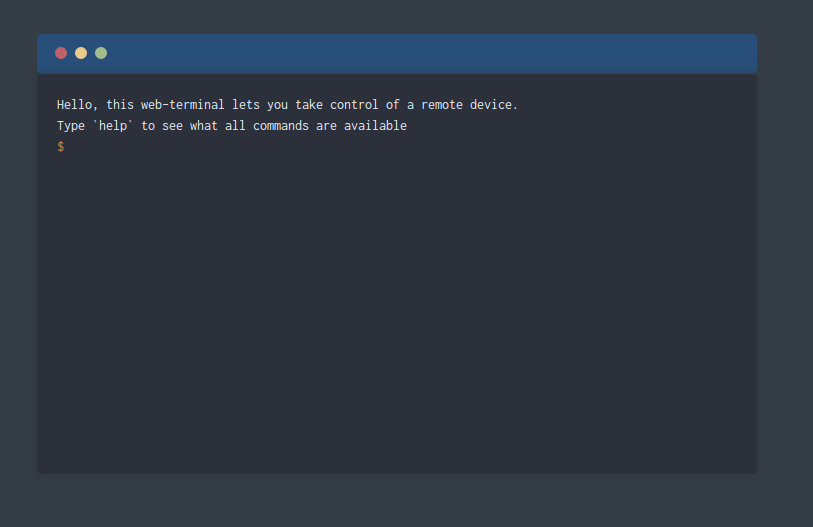

# rtc-web-term 

Cool Web-RTC web-terminal that works well with the [rtc-shell](https://github.com/roccomuso/rtc-shell) utility to enstablish a P2P connection.

## How this works

1. An "offer" will be generated by the initiator (rtc-shell). Paste this into the web-terminal hit enter.
2. The web-terminal generates an "answer". Paste this into the initiator's shell and hit enter.
3. Now you have a direct P2P connection between the shell and the browser web-page!

Supposing you're using [rtc-shell](https://github.com/roccomuso/rtc-shell) just launch it with: `rtc-shell -l -x /bin/sh`, then copy and paste the initiator string into the web-terminal using the command:

`@signal <initiator>`

The web-terminal will reply with another initiator, copy and paste it to the rtc-shell and hit enter.

You're ready to go! A browser-based p2p-shell.

## Enhancement

In a real-world application, you would never do this.
A "signaling server" (usually implemented with websockets) would be used to exchange signaling data between the two browsers until a peer-to-peer connection is established.
Avoiding a manual handshake.

## Author

Rocco Musolino ([@roccomuso](https://twitter.com/roccomuso))
